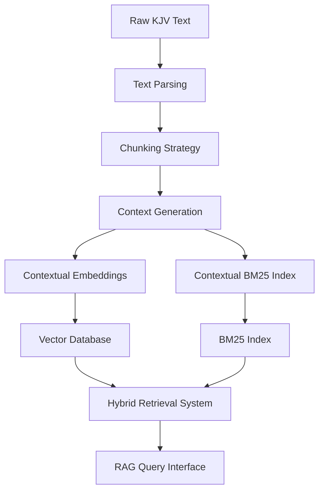

# Bible Knowledge Graph - Data Ingestion Specification

## Objective

Create a Retrieval Augmented Generation (RAG) system for the King James Bible using Anthropic's Contextual Retrieval approach to maintain context awareness when querying biblical content.

## Data Source

- Source file: `docs/data/kjv.txt`
- Format: Plain text with verses in format: `Book Chapter:Verse Text of the verse`
- Special formatting: Square brackets `[]` around implied words

## Data Ingestion Pipeline



## 1. Text Parsing

Parse the KJV.txt file into structured data:

- Skip header lines (first two lines of the file)
- Extract book, chapter, verse, and text
- Handle special formatting (e.g., words in square brackets)
- Normalize text formatting issues (line wrapping, indentation)

**Text Parsing Algorithm:**

1. Open the KJV.txt file and read it line by line
2. Skip the first two header lines ("KJV" and the copyright notice)
3. For each line:
   - Extract the book name, chapter number, verse number, and verse text using regex pattern matching
   - Identify words in square brackets as implied words
   - Create a structured verse object with the following properties:
     - Book name
     - Chapter number (as integer)
     - Verse number (as integer)
     - Full verse text
     - List of implied words
     - Reference string (e.g., "Genesis 1:1")
4. Return the collection of structured verse objects

**Example Parsed Structure:**

The parsing process will produce a collection of verse objects. Each verse object contains:
- Book name (e.g., "Genesis")
- Chapter number (e.g., 1)
- Verse number (e.g., 1)
- Full verse text (e.g., "In the beginning God created the heaven and the earth.")
- List of implied words (words in square brackets in the original text)
- Reference string (e.g., "Genesis 1:1")

```json
{
  "verses": [
    {
      "book": "Genesis",
      "chapter": 1,
      "verse": 1,
      "text": "In the beginning God created the heaven and the earth.",
      "implied_words": [],
      "reference": "Genesis 1:1"
    },
    {
      "book": "Genesis",
      "chapter": 1,
      "verse": 2,
      "text": "And the earth was without form, and void; and darkness [was] upon the face of the deep. And the Spirit of God moved upon the face of the waters.",
      "implied_words": ["was"],
      "reference": "Genesis 1:2"
    }
  ]
}
```

## 2. Chunking Strategy

The Bible presents unique chunking challenges. We'll implement a hybrid chunking strategy:

### Primary Approach: Passage-level Chunks

Group verses into logical passages based on:
- Narrative coherence
- Thematic unity
- Traditional passage divisions

**Passage-level Chunking Algorithm:**

1. Initialize an empty list to store passage chunks
2. Track the current passage, book, and chapter
3. Iterate through the verses sequentially:
   - When encountering a new book or chapter, create a new passage
   - Check for passage boundary indicators such as:
     - Topic changes
     - Narrative shifts
     - Traditional passage divisions
     - Paragraph markers
   - When a boundary is detected, complete the current passage and start a new one
   - Add the current verse to the current passage
4. For each completed passage:
   - Store all verses in the passage
   - Create a reference string (e.g., "Genesis 1:1-5")
   - Combine all verse texts into a single passage text
5. Return the collection of passage chunks

**Example Passage Chunk Schema:**

```json
{
  "verses": [
    {
      "book": "Genesis",
      "chapter": 1,
      "verse": 1,
      "text": "In the beginning God created the heaven and the earth.",
      "implied_words": [],
      "reference": "Genesis 1:1"
    },
    {
      "book": "Genesis",
      "chapter": 1,
      "verse": 2,
      "text": "And the earth was without form, and void; and darkness [was] upon the face of the deep. And the Spirit of God moved upon the face of the waters.",
      "implied_words": ["was"],
      "reference": "Genesis 1:2"
    }
  ],
  "reference": "Genesis 1:1-2",
  "text": "In the beginning God created the heaven and the earth. And the earth was without form, and void; and darkness was upon the face of the deep. And the Spirit of God moved upon the face of the waters."
}
```

### Secondary Approach: Sliding Window Chunks

For passages that don't fit neatly into logical divisions, use a sliding window approach:

**Sliding Window Chunking Algorithm:**

1. Define a window size (e.g., 7 verses) and overlap percentage (e.g., 50%)
2. Calculate the step size based on window size and overlap
3. Iterate through the verses with the calculated step size:
   - For each position, take a window of verses of the specified size
   - Create a chunk containing:
     - All verses in the window
     - A reference string spanning the window (e.g., "Genesis 1:1-7")
     - Combined text of all verses in the window
4. Return the collection of overlapping chunks

This approach ensures that context is preserved across chunk boundaries by including the same verses in multiple chunks.

### Hybrid Approach Implementation

**Hybrid Chunking Algorithm:**

1. First, apply the passage-level chunking algorithm to create logical passage chunks
2. Evaluate each passage chunk:
   - If the passage is of reasonable length (e.g., ≤15 verses), keep it as is
   - If the passage is too long or lacks clear boundaries:
     - Apply the sliding window approach to that specific passage
     - Replace the long passage with multiple overlapping window chunks
3. Return the final collection of chunks, which will be a mix of:
   - Natural passage chunks that preserve narrative or thematic unity
   - Sliding window chunks for sections that don't fit neatly into passages

This hybrid approach balances natural text divisions with the need for manageable chunk sizes.

## 3. Context Generation

Following Anthropic's Contextual Retrieval approach, we'll generate context for each chunk using an LLM:

**Context Generation Algorithm:**

1. For each chunk, prepare a prompt for the LLM that includes:
   - The chunk text
   - Instructions to provide succinct contextual information
   - Requirements to include book, timeline, key figures, and narrative context
   - Direction to focus only on information that helps situate the chunk within the Bible

2. Send the prompt to an LLM (e.g., Anthropic Claude) with instructions to:
   - Keep the context concise (50-100 tokens)
   - Focus on information that would help with retrieval
   - Include only the contextual information, without additional commentary

3. Receive the generated context from the LLM and associate it with the chunk

4. Store both the original chunk and its generated context together

**Example Chunk with Context Schema:**

```json
{
  "chunk_id": "genesis_1_1-5",
  "verses": [
    {"reference": "Genesis 1:1", "text": "In the beginning God created the heaven and the earth."},
    {"reference": "Genesis 1:2", "text": "And the earth was without form, and void; and darkness [was] upon the face of the deep. And the Spirit of God moved upon the face of the waters."}
  ],
  "reference": "Genesis 1:1-5",
  "text": "In the beginning God created the heaven and the earth. And the earth was without form, and void; and darkness was upon the face of the deep. And the Spirit of God moved upon the face of the waters.",
  "context": "This is from the creation account at the very beginning of Genesis, the first book of the Bible. It describes God's creation of light on the first day of creation, establishing the pattern of God speaking things into existence and separating elements of creation."
}
```

Example context for Genesis 1:1-5:

```
"This is from the creation account at the very beginning of Genesis, the first book of the Bible. It describes God's creation of light on the first day of creation, establishing the pattern of God speaking things into existence and separating elements of creation."
```

## 4. Contextual Embeddings and BM25 Index

Create two parallel retrieval systems:

### 4.1 Contextual Embeddings

**Contextual Embeddings Algorithm:**

1. For each chunk with its generated context:
   - Prepend the context to the chunk text to create a contextual text
   - Generate an embedding vector for this combined contextual text using an embedding model
   - Store the embedding vector with the chunk

2. To store these embeddings in a vector database:
   - Initialize a connection to the vector database
   - For each chunk:
     - Create a document with a unique ID based on the chunk reference
     - Include the embedding vector
     - Add metadata such as reference, book, chapter, verse numbers, and context
     - Include the original text
   - Insert all documents into the vector database

This approach ensures that the embeddings capture both the content of the chunk and its broader biblical context.

**Example Vector Database Document Schema:**

```json
{
  "id": "genesis_1_1-5",
  "embedding": [0.123, -0.456, 0.789, ...],
  "metadata": {
    "reference": "Genesis 1:1-5",
    "book": "Genesis",
    "chapter": 1,
    "verses": [1, 2, 3, 4, 5],
    "context": "This is from the creation account at the very beginning of Genesis, the first book of the Bible. It describes God's creation of light on the first day of creation, establishing the pattern of God speaking things into existence and separating elements of creation."
  },
  "text": "In the beginning God created the heaven and the earth. And the earth was without form, and void; and darkness was upon the face of the deep. And the Spirit of God moved upon the face of the waters."
}
```

### 4.2 Contextual BM25 Index

**Contextual BM25 Index Algorithm:**

1. Prepare a corpus for BM25 indexing:
   - For each chunk, combine its context and text into a single contextual text
   - Add this contextual text to the corpus

2. Process the corpus for BM25 indexing:
   - Tokenize each contextual text (split into words)
   - Apply any necessary text preprocessing (lowercasing, stemming, etc.)

3. Create a BM25 index using the tokenized corpus:
   - Calculate term frequencies
   - Compute inverse document frequencies
   - Apply the BM25 weighting formula with appropriate parameters

4. Store the BM25 index alongside the original chunks for later retrieval

This approach enables precise term matching while still benefiting from the contextual information.

## 5. Hybrid Retrieval System

Implement a hybrid retrieval system that combines vector search and BM25:

**Hybrid Retrieval Algorithm:**

1. Process the user query:
   - Generate an embedding vector for the query
   - Tokenize the query for BM25 search

2. Perform vector search:
   - Search the vector database using the query embedding
   - Retrieve the top results (e.g., top-k × 2 to allow for fusion)
   - Each result includes a chunk ID and similarity score

3. Perform BM25 search:
   - Calculate BM25 scores for the tokenized query against the BM25 index
   - Identify the top-scoring chunks
   - Create a result set with chunk IDs and BM25 scores

4. Apply rank fusion:
   - Combine the results from vector search and BM25 search
   - Use a rank fusion algorithm (e.g., reciprocal rank fusion)
   - This balances semantic similarity with term matching

5. Return the top-k chunks after fusion:
   - Retrieve the full chunk data for each result
   - Include the original text, context, and metadata

This hybrid approach leverages both semantic understanding and precise term matching.

**Example Query Result Schema:**

```json
{
  "query": "What did God create first?",
  "results": [
    {
      "reference": "Genesis 1:1-5",
      "context": "This is from the creation account at the very beginning of Genesis, the first book of the Bible. It describes God's creation of light on the first day of creation, establishing the pattern of God speaking things into existence and separating elements of creation.",
      "text": "In the beginning God created the heaven and the earth. And the earth was without form, and void; and darkness was upon the face of the deep. And the Spirit of God moved upon the face of the waters. And God said, Let there be light: and there was light. And God saw the light, that it was good: and God divided the light from the darkness. And God called the light Day, and the darkness he called Night. And the evening and the morning were the first day.",
      "score": 0.92,
      "metadata": {
        "testament": "Old Testament",
        "book_type": "Law",
        "people": ["God"],
        "places": ["heaven", "earth"]
      }
    },
    {
      "reference": "John 1:1-5",
      "context": "This is from the beginning of John's Gospel in the New Testament. It presents a theological parallel to Genesis 1, describing Jesus as the Word (Logos) who was with God from the beginning and through whom all things were created.",
      "text": "In the beginning was the Word, and the Word was with God, and the Word was God. The same was in the beginning with God. All things were made by him; and without him was not any thing made that was made. In him was life; and the life was the light of men. And the light shineth in darkness; and the darkness comprehended it not.",
      "score": 0.87,
      "metadata": {
        "testament": "New Testament",
        "book_type": "Gospels",
        "people": ["God", "Word (Jesus)"],
        "places": []
      }
    }
  ]
}
```

## 6. Metadata Enrichment

Enhance each chunk with additional metadata:

**Metadata Enrichment Algorithm:**

1. For each chunk, extract and add the following metadata:

   - Testament classification:
     - Determine if the book is in the Old Testament or New Testament
     - Use a predefined list of Old Testament books for classification

   - Book type categorization:
     - Classify each book into categories such as:
       - Law (e.g., Genesis, Exodus)
       - History (e.g., Joshua, Kings)
       - Wisdom (e.g., Psalms, Proverbs)
       - Prophets (e.g., Isaiah, Daniel)
       - Gospels (e.g., Matthew, John)
       - Epistles (e.g., Romans, Hebrews)
       - Apocalyptic (e.g., Revelation)

   - Entity extraction:
     - Identify people mentioned in the text
     - Identify places mentioned in the text
     - Use named entity recognition techniques or predefined biblical entity lists

2. Store all metadata with the chunk for use in filtering and enhancing retrieval

This enriched metadata enables more sophisticated querying and filtering capabilities.

**Example Chunk with Metadata Schema:**

```json
{
  "chunk_id": "genesis_1_1-5",
  "verses": [...],
  "reference": "Genesis 1:1-5",
  "text": "In the beginning God created the heaven and the earth. And the earth was without form, and void; and darkness was upon the face of the deep. And the Spirit of God moved upon the face of the waters.",
  "context": "This is from the creation account at the very beginning of Genesis, the first book of the Bible. It describes God's creation of light on the first day of creation, establishing the pattern of God speaking things into existence and separating elements of creation.",
  "metadata": {
    "testament": "Old Testament",
    "book_type": "Law",
    "people": ["God", "Spirit of God"],
    "places": ["heaven", "earth", "waters", "deep"]
  }
}
```

## 7. Implementation Plan

### Phase 1: Data Parsing and Chunking

1. Parse the KJV.txt file into structured verse data
2. Implement the hybrid chunking strategy
3. Store the chunked data in an intermediate format

### Phase 2: Context Generation

1. Set up integration with an LLM API (e.g., Anthropic Claude)
2. Generate context for each chunk
3. Store the chunks with their context

### Phase 3: Indexing

1. Implement the contextual embedding generation
2. Set up a vector database
3. Create the BM25 index
4. Store both indices for retrieval

### Phase 4: Retrieval System

1. Implement the hybrid retrieval function
2. Create a simple API for querying the system
3. Develop a basic web interface for demonstration

## 8. Technical Requirements

### Dependencies

**Required Technologies:**

- **Data Processing**: Tools for text processing, parsing, and manipulation
- **Embedding Models**: Models capable of generating vector representations of text
- **Vector Database**: System for storing and querying vector embeddings
- **BM25 Implementation**: Library or implementation of the BM25 algorithm
- **LLM API**: Access to a large language model for context generation
- **Web Framework**: Optional framework for creating a query interface

### Infrastructure

- Python 3.8+ environment
- Vector database (Pinecone, Weaviate, or similar)
- LLM API access (Anthropic Claude recommended)
- Storage for intermediate data and indices

## 9. Evaluation

Evaluate the system using:

1. **Retrieval accuracy**: Test with known queries and expected passages
2. **Context quality**: Assess the quality of generated context
3. **Query relevance**: Evaluate the relevance of retrieved passages to queries
4. **Performance metrics**: Measure query latency and resource usage

## 10. Example Implementation

Here's a simplified example of how the complete pipeline would work:

**Complete Pipeline Workflow:**

1. **Data Parsing**:
   - Parse the KJV Bible text file into structured verse data
   - Extract book, chapter, verse, and text information
   - Handle special formatting and create verse objects

2. **Chunking**:
   - Apply the hybrid chunking strategy to the parsed verses
   - Create a mix of passage-based and sliding window chunks
   - Ensure each chunk has appropriate reference information

3. **Context Generation**:
   - For each chunk, generate contextual information using an LLM
   - Store this context with the chunk

4. **Metadata Enrichment**:
   - Add testament, book type, and entity information to each chunk
   - Enhance the chunks with additional metadata for improved retrieval

5. **Contextual Embeddings**:
   - Generate embeddings for each chunk with its prepended context
   - Store these embeddings in a vector database

6. **BM25 Indexing**:
   - Create a BM25 index using the contextual text of each chunk
   - Store this index for keyword-based retrieval

7. **Retrieval System**:
   - Set up a hybrid retrieval function that combines vector search and BM25
   - Implement rank fusion to balance semantic and keyword matching
   - Return the most relevant chunks for a given query

8. **Query Interface**:
   - Create a simple interface for querying the Bible knowledge graph
   - Display results with references, context, and text

## Conclusion

This data ingestion specification outlines a comprehensive approach to creating a Bible knowledge graph using Anthropic's Contextual Retrieval technique. By preserving the context of each chunk, the system will provide more accurate and relevant results when querying biblical content.

The implementation combines traditional RAG techniques with the latest advancements in contextual retrieval, resulting in a system that understands both the semantic meaning and the broader context of biblical passages.

## Note for AI

When implementing this specification, focus on creating a system that maintains context awareness throughout the retrieval process. The key innovation of Contextual Retrieval is the preservation of context during chunking and embedding, which significantly improves retrieval accuracy. Avoid simply implementing a standard RAG system without the contextual enhancements described in this document.

## Local Model Implementation

For implementing this system with local models, Qwen3:32b running via Ollama is a strong candidate:

### Advantages of Qwen3:32b for this project:

1. **Sufficient context window**: Qwen3 models have a context window of 32K tokens, which is ample for processing Bible passages and generating contextual information.

2. **Strong contextual understanding**: As a 32B parameter model, Qwen3 has strong capabilities for understanding biblical text and generating relevant contextual descriptions.

3. **Local deployment**: Running via Ollama means no API costs or latency issues associated with cloud-based LLMs.

4. **Multilingual capabilities**: If future extensions include non-English Bible versions, Qwen3 has strong multilingual capabilities.

### Implementation considerations:

1. **Hardware requirements**: A 32B parameter model requires significant GPU memory (minimum 24GB VRAM recommended) for optimal performance.

2. **Batch processing**: Context generation for all chunks can be time-consuming with a local model. Consider implementing batch processing with progress tracking.

3. **Prompt engineering**: The context generation prompt may need refinement for Qwen3 compared to Claude. Test with a small sample of passages first.

4. **Embedding model**: For vector embeddings, consider pairing with a local embedding model like all-MiniLM-L6-v2 via Sentence Transformers, which can run efficiently on CPU.

5. **Quantization options**: If memory is constrained, Ollama supports running Qwen3 with various quantization levels (e.g., Q4_0, Q5_K_M) to reduce VRAM requirements at some cost to quality.

This approach would create a fully local, cost-effective implementation of the Contextual Retrieval system for the Bible knowledge graph.
